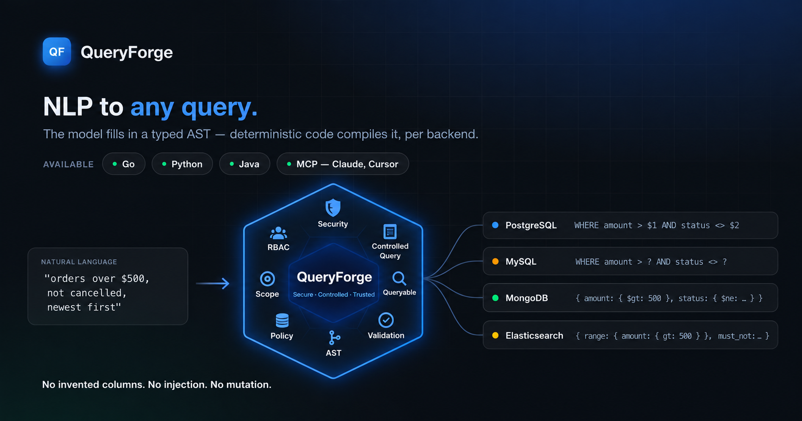

<div align="center">



# QueryForge

**Replace the whole filter panel with one sentence.**

[](https://github.com/awsaman-ai/queryforge/actions/workflows/ci.yml)
[](https://pkg.go.dev/github.com/awsaman-ai/queryforge)
[](LICENSE)
[](go.mod)
[](https://pypi.org/project/queryforge-ai/)
[](https://central.sonatype.com/artifact/io.github.awsaman-ai/queryforge)

[**Website**](https://queryforge-service.amtry.in) · [**Docs**](https://awsaman-ai.github.io/queryforge/) · [**Config builder**](https://awsaman-ai.github.io/queryforge/config-builder.html) · [**MCP server**](https://github.com/awsaman-ai/queryforge_mcp) · [**qfeval**](https://github.com/awsaman-ai/qfeval)

</div>

---

Your users stop translating what they want into dropdowns, checkboxes and date pickers — they just say it. You get back a parameterized query you can actually trust.

```
"orders over 500 dollars in the last 30 days that were not cancelled, newest first, top 20"
```

```sql
SELECT status, created_at, amount, customer_name FROM orders
WHERE (status <> $1 AND created_at >= $2 AND amount > $3)
ORDER BY created_at DESC LIMIT 20
-- args: ["CANCELLED", "2026-06-29T08:49:06Z", 500]
```

The same sentence, against MongoDB, from the identical intermediate object — no second prompt:

```javascript
{ amount: {$gt: 500}, createdAt: {$gte: "2026-06-29T08:49:06Z"}, status: {$ne: "CANCELLED"} }
```

## Why not just ask an LLM for SQL?

Because you can't check what comes back. A model asked for SQL can invent a column, invent a table, quietly widen a filter, or hand you a statement that is only *probably* right.

QueryForge never lets the model near a query string. It fills in a **typed form** — the Query AST — constrained to a vocabulary your config registers. Everything after that is ordinary Go:

```
Natural language  →  [ AI planner ]  →  Query AST  →  [ generators ]  →  SQL / MySQL / Mongo
   (unbounded)        model + config     (typed)       pure code — no AI, no network
```

| | |
|---|---|
| **Invented a field?** | Rejected by the validator before anything compiles — with "did you mean" suggestions. |
| **SQL injection?** | The model emits structure, never a string. Values are bound (`$1`, `$2`); only config-supplied identifiers reach the statement. |
| **Asked to delete something?** | Not expressible. The AST has no mutation node, so every output is a `SELECT` or a `find`. |
| **Asked about a field you hid?** | `returnable: false` is enforced on the default projection too, not just explicit `select`. |
| **Asked something impossible?** | A typed refusal — not a plausible query built on a lookalike field. |
| **Asked for another tenant's rows?** | Scope filters (below) are AND-ed on after the model answers. It never learns the field exists. |

Everything that must be *guaranteed* lives on the deterministic side, where it can be tested offline.

## Install

Four ways to call it. All need the same two things and nothing else: a **config file** describing your data ([build one in your browser](https://awsaman-ai.github.io/queryforge/config-builder.html)) and a **model API key** in the environment. No server, no Docker, no database connection.

<details open>
<summary><b>🐹 Go — the library</b></summary>

```bash
go get github.com/awsaman-ai/queryforge
```

```go
cfg, _ := qf.LoadConfig("orders.config.json")
engine := qf.New(cfg)

res, _ := engine.Translate(ctx, "cancelled orders over 200 dollars", "sql", nil)

fmt.Println(res.Query.SQL)   // SELECT … WHERE (status = $1 AND amount > $2) …
fmt.Println(res.Query.Args)  // [CANCELLED 200]
fmt.Println(res.Explain)     // plain-English readback of what it understood
```

No third-party dependencies — standard library only. [API docs →](https://pkg.go.dev/github.com/awsaman-ai/queryforge)

</details>

<details>
<summary><b>🐍 Python — pip</b></summary>

```bash
pip install queryforge-ai   # installs as queryforge-ai, imports as queryforge
```

```python
from queryforge import QueryForge

qf = QueryForge.postgres("orders.config.json")
pending = qf.query("cancelled orders over $200")

print(pending.to_sql())    # SELECT … WHERE (status = $1 AND amount > $2) …
print(pending.to_args())   # ('CANCELLED', 200)
```

The engine ships inside the wheel — no Go toolchain needed. [Docs →](sdk-python/README.md)

</details>

<details>
<summary><b>☕ Java — Maven, Java 11+</b></summary>

[](https://central.sonatype.com/artifact/io.github.awsaman-ai/queryforge)

Two dependencies: the classes, and the engine binary for the platform you run on. Set the property once to the version in the badge above and both stay in step.

```xml
<properties>
    <queryforge.version>LATEST</queryforge.version>  <!-- the version in the badge -->
</properties>

<dependency>
    <groupId>io.github.awsaman-ai</groupId>
    <artifactId>queryforge</artifactId>
    <version>${queryforge.version}</version>
</dependency>
<dependency>
    <groupId>io.github.awsaman-ai</groupId>
    <artifactId>queryforge</artifactId>
    <version>${queryforge.version}</version>
    <classifier>linux-amd64</classifier>
</dependency>
```

```java
QueryForge forge = QueryForge.postgres(Paths.get("orders.config.json"));

String sql       = forge.query("cancelled orders over $200").toSql();
List<Object> args = forge.query("cancelled orders over $200").toArgs();
```

Zero runtime dependencies — not even a JSON library. [Docs →](sdk-java/README.md)

</details>

<details>
<summary><b>🔌 MCP — Claude Desktop, Cursor</b></summary>

```bash
go install github.com/awsaman-ai/queryforge_mcp@latest
```

```json
{
  "mcpServers": {
    "queryforge": {
      "command": "queryforge-mcp",
      "args": ["--config", "orders.config.json"]
    }
  }
}
```

Restart Claude and ask *"cancelled orders over $200"* — it comes back as a validated query. [Docs →](https://github.com/awsaman-ai/queryforge_mcp)

</details>

Whichever you pick, the answer is the same query. Swap `postgres` for `mysql` or `mongo` and the same sentence compiles for that backend instead.

**QueryForge never connects to your database.** It hands you the query; executing it stays yours.

## Configure

One JSON file is the prompt context, the validation rulebook, the field→backend mapping, and the model selector:

```jsonc
{
  "entity": "Order",
  "model":    { "provider": "gemini", "baseURL": "…/v1beta/openai",
                "model": "gemini-3.1-flash-lite", "apiKeyEnv": "QF_API_KEY" },
  "backends": { "sql": { "table": "orders" }, "mongo": { "collection": "orders" } },
  "fields": [
    { "name": "status", "type": "enum", "values": ["PLACED", "DELIVERED", "CANCELLED"],
      "synonyms": ["state", "delivery status"],
      "mapping": { "sql": "status", "mongo": "status" } },
    { "name": "amount", "type": "number",
      "mapping": { "sql": "amount", "mongo": "amount" } },
    { "name": "createdAt", "type": "date",
      "mapping": { "sql": "created_at", "mongo": "createdAt" } }
  ]
}
```

**Don't hand-write it — build it.** The [config builder](https://awsaman-ai.github.io/queryforge/config-builder.html) is a single self-contained page (open it straight from disk, nothing leaves the browser). Four settings per field up front, the rest behind **Advanced**, every one with an ⓘ and a worked example, validated as you type by the same rules the loader enforces.

📖 **[Full configuration reference →](https://awsaman-ai.github.io/queryforge/)**

## Try it

```bash
# Offline — no API key. Compiles a hand-written AST.
go run ./examples -config examples/orders.config.json -backend sql   -ast sample_ast.json
go run ./examples -config examples/orders.config.json -backend mongo -ast sample_ast.json

# Natural language — needs a key.
export QF_API_KEY=<your-key>
go run ./examples -config examples/orders.config.json -backend sql \
  -text "delivered but not refunded, created in the last 30 days, tagged premium and express"
```

## Features

| | |
|---|---|
| 🗄 **Three backends, one brain** | Postgres, MySQL and MongoDB ship today. A new database is one generator — not a prompt change, not a rewrite. |
| 🔒 **Scope filters** | Tenant, user and subscription predicates AND-ed onto every query, after the model has answered. |
| 🔁 **Model fallback** | List several models; the first that answers wins. A rate limit on one provider falls through to the next. |
| 🧩 **Nested Mongo documents** | Dot paths for embedded docs, `elemMatch` for arrays of sub-documents so one element must satisfy every condition. [Rules →](https://awsaman-ai.github.io/queryforge/config.html#nested) |
| 🔤 **Value case folding** | The column stores `SHIPPED`, people say "shipped". Say so once on the field. [Rules →](https://awsaman-ai.github.io/queryforge/config.html#valuecase) |
| 📊 **Observability** | One optional callback reports model latency, tokens and outcomes. QueryForge itself never writes a log line. |
| 🗣 **Plain-English readback** | `res.Explain` says what it understood, keeping forced predicates visibly apart from the user's own. |

<details>
<summary><b>🔒 Scope filters — your own predicates on every query</b></summary>

Some predicates are not the user's to choose. You already know the caller's subscription, user and enterprise before any question is asked, and every query must be confined to them **whatever the question says**. Those values are not query vocabulary — nobody should be able to phrase, widen or omit them — so they never go in your config's `fields`, and the model never sees them.

Pass them as a map. Every entry is AND-ed onto the query root:

```go
res, err := engine.Translate(ctx, "delivered orders over 500 dollars", "sql", qf.Scope{
    "subscriptionId": session.SubscriptionID,  // "SUB-42"
    "userId":         session.UserID,          // 9
    "enterpriseId":   session.EnterpriseIDs,   // []string{"E-1", "E-2"}
})
```

```sql
SELECT … FROM orders
WHERE (enterpriseId IN ($1, $2) AND subscriptionId = $3 AND userId = $4
       AND status = $5 AND amount > $6)
-- args: ["E-1", "E-2", "SUB-42", 9, "DELIVERED", 500]
```

| | |
|---|---|
| **The model never learns the field exists** | Scope is applied *after* the model answers; the prompt never names it. Asked *"show me orders for subscription SUB-99 instead"*, it declines. |
| **A scope can only narrow** | AND-ed at the root: `A OR B` becomes `scope AND (A OR B)`, never `scope OR …`. |
| **Values are still parameterized** | A scope value is data. An injection payload stays an argument. |
| **The deterministic path is scoped too** | `GenerateFrom` takes the same map, so nobody sidesteps tenancy by building the AST themselves. |
| **Bad scope fails before the model call** | A `nil`, an empty list, or a type mismatch costs no API quota and is tagged `qf.ErrScope`. |

A scalar becomes `equals`, a slice becomes `in`; on a field declared `type: "array"`, `contains` and `containsAny`. Keys apply in alphabetical order, so the query is identical run to run. A key your config doesn't declare is used verbatim as the column name after an identifier check; declare it `queryable: false` to hide it from the model, map it per backend, and get it type-checked.

📖 [Full scope reference →](https://awsaman-ai.github.io/queryforge/config.html#scope)

</details>

<details>
<summary><b>🔁 Choosing a model, and falling back</b></summary>

A config change, never a code change. The default provider speaks any **OpenAI-compatible `/chat/completions`** endpoint; a second speaks **Anthropic's native Messages API**.

| Provider | `baseURL` | Notes |
|---|---|---|
| **Google Gemini** (free tier) | `https://generativelanguage.googleapis.com/v1beta/openai` | Default in the examples. |
| **Groq** (free tier) | `https://api.groq.com/openai/v1` | Fast Llama/Qwen class. |
| **OpenAI** | `https://api.openai.com/v1` | e.g. `gpt-4.1-mini`. |
| **Anthropic** (native) | `https://api.anthropic.com` | Set `provider: "anthropic"`, e.g. `claude-opus-4-8`. |
| **Ollama** (local, no key) | `http://localhost:11434/v1` | Fully offline. Leave `apiKeyEnv` empty. |

The key value never lives in the config — `apiKeyEnv` names the environment variable that holds it.

**Fallback.** List several and QueryForge tries them in order, using the first that answers, so a rate limit or billing block falls through transparently:

```jsonc
"model":  { "provider": "gemini", "model": "gemini-3.1-flash-lite", "apiKeyEnv": "QF_API_KEY", "baseURL": "…" },
"models": [
  { "provider": "groq",      "baseURL": "https://api.groq.com/openai/v1", "model": "llama-3.3-70b-versatile", "apiKeyEnv": "GROQ_API_KEY" },
  { "provider": "anthropic", "baseURL": "https://api.anthropic.com",      "model": "claude-opus-4-8",         "apiKeyEnv": "ANTHROPIC_API_KEY" },
  { "provider": "ollama",    "baseURL": "http://localhost:11434/v1",      "model": "qwen2.5" }
]
```

Ready to run: [`examples/orders.fallback.config.json`](examples/orders.fallback.config.json).

</details>

<details>
<summary><b>📊 Observability</b></summary>

QueryForge never writes a log line. It reports facts through one optional callback and lets you decide destination, format and severity:

```go
engine.SetObserver(func(ctx context.Context, e qf.Event) {
    switch e.Kind {
    case qf.EventModelCall:  // one round trip: latency, tokens, finish reason
    case qf.EventAttempt:    // one plan+validate cycle; e.Raw on failure
    case qf.EventTranslate:  // the whole call, on every exit path
    }
})
```

A traced live request measured the entire deterministic half — parse, validate, compile, explain — at **0.5 ms** against a **1,781 ms** model call. Roughly **99.97%** of a translation is one HTTP round trip, so the seam watches the model interaction and leaves the deterministic core alone.

**Privacy is a design property, not a convention.** The question text is never in an `Event`. Scope *values* are never in an `Event` — only `ScopeKeys` — because those values are tenant, user and enterprise ids. The API key is never in an `Event`. The one field that can echo caller data is `Raw`, the model's verbatim reply, populated only on a *failed* attempt; log it at debug level and truncate. A test asserts the rest with a canary.

Use `SetObserver`, not `engine.Observe`: only the former pushes the observer down into the provider, where latency and token counts live. The callback is synchronous, must be concurrency-safe, and must not panic.

</details>

<details>
<summary><b>🌳 What the AST looks like</b></summary>

**AST = Abstract Syntax Tree** — a plain JSON object describing *what the user asked for*, between the sentence and the query. A **tree** because filters nest; **abstract** because it knows nothing about SQL or Mongo: it says `"operator": "gt"`, never `>` and never `$gt`.

```json
{
  "entity": "Order",
  "filter": {
    "type": "logical", "op": "AND",
    "children": [
      { "type": "comparison", "field": "amount",    "operator": "gt",        "value": {"kind":"number","v":500} },
      { "type": "comparison", "field": "createdAt", "operator": "after",     "value": {"kind":"relative_date","unit":"day","amount":-30} },
      { "type": "comparison", "field": "status",    "operator": "notEquals", "value": {"kind":"enum","v":"CANCELLED"} }
    ]
  },
  "sort":  [{ "field": "createdAt", "dir": "DESC" }],
  "limit": 20
}
```

That one object compiles to SQL *and* Mongo with no second prompt. And it has **no node type that can write** — so "read-only" doesn't depend on a check someone might forget; it depends on there being no way to express a write.

📖 [Full AST reference →](https://awsaman-ai.github.io/queryforge/config.html#ast)

</details>

## Other languages

The same engine ships as a native library for Python and Java. Each SDK spawns the bundled binary as a **local subprocess** and exchanges one JSON object over stdin/stdout — no HTTP, no daemon, no socket. The SDKs contain **no query logic whatsoever**, so all three languages produce byte-identical output.

| | Python | Java |
|---|---|---|
| Install | `pip install queryforge-ai` | one Maven `<dependency>` |
| Runtime dependencies | none | none — not even a JSON library |
| Wrapper size | ~30 KB of code | ~35 KB jar |
| Engine binary | in the platform wheel (~6 MB) | in an auto-selected classifier jar (~2.5 MB) |
| Docs | [sdk-python/README.md](sdk-python/README.md) | [sdk-java/README.md](sdk-java/README.md) |

Both offer the full pipeline (`query`, one model call) and the deterministic half (`generate` / `validate` — no model call, no API key, testable offline). Writing an SDK for another language? The wire format is specified in [cmd/queryforge/PROTOCOL.md](cmd/queryforge/PROTOCOL.md).

## Testing

The deterministic half is fully tested with **no API key and no network**:

```bash
go test ./...
```

Every component ships happy-path and adversarial "try to break it" tests — injection strings, unknown fields, illegal operator/type pairs, out-of-domain enums, deep nesting, oversized limits. CI also runs [golangci-lint](https://golangci-lint.run) against [`.golangci.yml`](.golangci.yml).

What tests *cannot* cover is **comprehension** — whether the model reads a real sentence the way your user meant it. That's a statistical property of a remote service, so it needs a corpus and a pass rate. **[qfeval](https://github.com/awsaman-ai/qfeval)** grades a config against a CSV of sentences and the queries they should compile to. On its 25-case example corpus `gemini-3.1-flash-lite` scores **24/25** — and the one failure is an ambiguous sentence, not a misread one. A 573-case dataset covering every capability flag ships with it.

## Architecture

| File | Role | AI? |
|---|---|---|
| `ast.go` | Query AST types + JSON (de)serialization | — |
| `config.go` | Config types + loader + capability flags | — |
| `validate.go` | **The guarantee**: field/operator/type/enum/depth + capability checks, with suggestions | No |
| `generate.go`, `gen_sql.go`, `gen_mongo.go` | Registry + backend generators (parameterized, read-only) | No |
| `scope.go` | Caller-supplied filters → typed predicates AND-ed onto the query root | No |
| `explain.go` | AST → prose (dry-run, no execution) | No |
| `provider.go` | `ModelProvider` interface + OpenAI-compatible default + test stub | Yes |
| `planner.go` | Build prompt from config, parse model output → AST | Yes |
| `observe.go` | `Observer` seam: facts out, no logging | — |
| `queryforge.go` | `Engine`: `New`, `Translate`, `GenerateFrom`, `Validate`, `Register` | — |

The planner is the only place a model runs. Validate → generate → explain is pure Go — the guarantees live there.

## Ecosystem

| Project | What it is |
|---|---|
| **[queryforge_mcp](https://github.com/awsaman-ai/queryforge_mcp)** | QueryForge over the Model Context Protocol, so Claude Desktop, Cursor or any MCP client can query your data. The tool schema is generated from your config, so the model picks from your vocabulary instead of guessing. Hidden fields and physical column names never leave the process. |
| **[qfeval](https://github.com/awsaman-ai/qfeval)** | Scores a config against a golden file of sentences and expected queries. Compare two models on the same corpus before you pay for one. |
| [Documentation](https://awsaman-ai.github.io/queryforge/) | Guide, full configuration reference, and the Query AST explained. |
| [Config builder](https://awsaman-ai.github.io/queryforge/config-builder.html) | Build a config in a form and download it, with live validation. Runs entirely in the browser. |

## Roadmap

- **Shipped** — Go library, JSON config, validator, SQL/MySQL/Mongo generators, scope filters, model fallback, observability seam, CLI, MCP server, Python and Java SDKs.
- **Next** — Elasticsearch/OpenSearch generator, YAML config, confidence scores, REST facade.
- **Later** — Node and .NET SDKs over the same [stdio protocol](cmd/queryforge/PROTOCOL.md), a persistent engine process, an aggregation AST node, more backends (DynamoDB, Cassandra, ClickHouse).

## Contributing

Issues and pull requests are welcome. CI runs `gofmt`, `go vet` and the full suite with the race detector on every PR, including from forks — the suite is entirely offline, so it needs no API key. If you're changing behaviour, please add a test that fails without your change.

Security issues go through [private disclosure](SECURITY.md), not a public issue.

## License

[Apache 2.0](LICENSE) — use, modify, distribute and embed in commercial software, with an explicit patent licence from every contributor. Keep the notices, and state any significant changes you make.
