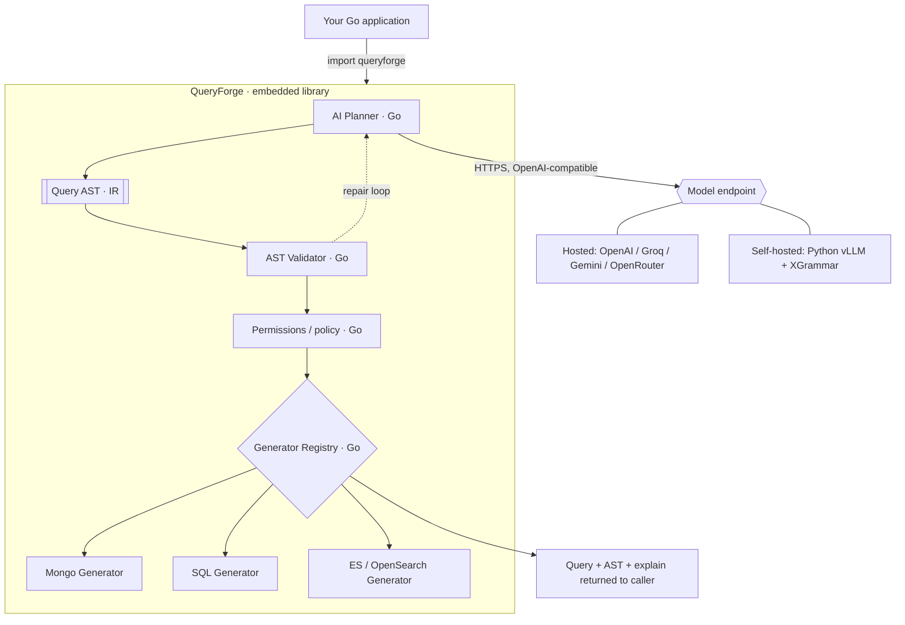
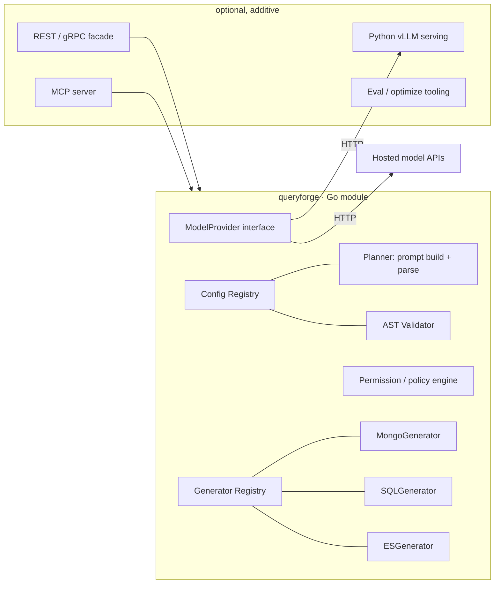
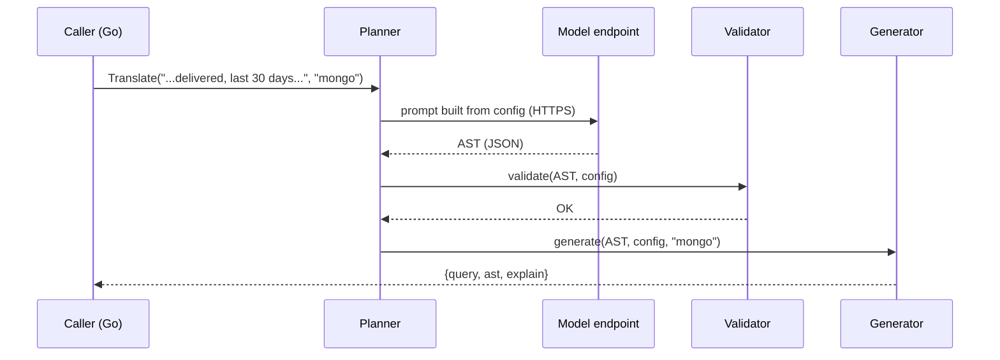

# QueryForge — Architecture & Design Document (v2)

*A configuration-driven **library** that compiles natural language into database queries across many backends.*

> **What changed in v2:** the product is now explicitly a **library, not a service**; the **first release target is Go** (an importable package you embed); the **AI layer is config-driven** and, by default, needs no separate service; and where AI code genuinely needs Python (self-hosted open models, offline tooling) it lives **behind a standard HTTP interface** so the Go library never depends on it.
> **Codename `QueryForge`** is a placeholder — rename freely.
> **Handoff note:** this document is written to be implemented by a coding agent (e.g. Claude Code). See §21 "Implementation guidance for the coding agent" for the hard constraints.
> **Currency note:** model names, pricing, and library defaults reflect mid-2026 and move fast. Treat every number as "verify before you commit."

---

## 0. The one idea that makes this not-another-text-to-SQL project

Every existing tool (Vanna, DB-GPT, WrenAI, MindsDB) makes the same bet: point an LLM at a database schema, retrieve relevant tables, and let it free-write a SQL string. That is unbounded, per-database, hard to secure, and impossible to guarantee.

**QueryForge makes a different bet:**

> The LLM never writes a query. It emits a **validated intermediate representation (Query AST)** constrained to a **fixed, registered vocabulary of fields and operators**. Deterministic code then compiles that AST to every backend.

It is a **compiler**, not a chatbot:

```
Natural language  →  [ AI frontend ]  →  Query AST (IR)  →  [ Deterministic backends ]  →  Mongo / SQL / ES / …
   (unbounded)         model + config      (bounded, typed)     pure code, no AI             (dialect-specific)
```

| Property | How the AST-centric design delivers it |
|---|---|
| **No hallucinated fields** | The AST is validated against the config *before* generation. Unknown field → hard rejection. |
| **No injection** | The model produces structure, never a string that touches your DB. |
| **N backends, 1 brain** | Add a database = implement one generator. Zero prompt or model changes. |
| **Model-agnostic & cheap** | The target is small and structured, so mid-tier or small models suffice. |
| **Independently testable** | NL→AST (probabilistic) and AST→query (deterministic) are tested separately; the deterministic half has no AI and no network. |
| **Config-driven, no training** | Consumers register metadata. The config *is* the prompt and the grammar. |

---

## 1. Product shape: this is a library

**QueryForge ships as an embeddable library, not a running service.** You `import` it and call it in-process. There is no server to deploy in the default path.

The engine has two halves with different natures:

| Half | What it does | Needs AI? | Where it runs |
|---|---|---|---|
| **Deterministic core** | config registry, AST validation, permissions, per-backend generators | No | **In-process, always** — pure library code |
| **AI planner** | natural language → AST | Yes | **In-process by default** — makes one HTTPS call to a model endpoint |

The only thing that could ever force a *service* on you is **self-hosting your own model** (a GPU process must live somewhere central). That is an **optional** path (§8.4). In the default path the library calls a hosted model endpoint directly — the same way an S3 client or a Stripe SDK makes network calls without being "a service."

**Two deployment modes, one codebase:**

- **Library mode (default):** deterministic core embedded + planner calls a hosted model endpoint. No QueryForge service to run.
- **Optional service facade:** the same library wrapped behind a thin REST/gRPC handler, for teams that want a central endpoint or need self-hosted models. Purely additive.

Because the boundary between the two halves is the **AST (JSON)**, the library never cares *how* the model is served — hosted API or a local endpoint, it's the same contract.

---

## 2. Language strategy: Go first, AI-serving optional-Python

**The release is a Go library. Both halves — deterministic core and the default planner — are pure Go.** The default planner talks to any **OpenAI-compatible `/chat/completions` endpoint** over HTTP, so no Python is required to use the product.

Python appears in exactly one place, and only optionally:

- **Self-hosted open models** (offline, data-residency, high volume). The best constrained-decoding stack (vLLM/SGLang + XGrammar) is Python-native. When a team wants this, they run a Python inference endpoint that is **OpenAI-compatible**, and the Go library points at it via config. The Go library is unchanged and unaware.
- **Offline tooling** (not in the request path): the eval harness, prompt-optimization experiments, and any later fine-tuning/distillation. Python is the natural home; none of it ships inside the Go library.

So: **"AI code in Python" = the optional self-host serving + offline tooling, always behind a standard HTTP interface.** The Go library remains the product and the request path.

| Concern | Decision |
|---|---|
| Product / first release | **Go library**, importable, embedded |
| Deterministic core (validate, generate) | **Go**, standard-library-first, offline-testable |
| Default AI planner | **Go**, calls a hosted OpenAI-compatible endpoint |
| Optional self-hosted model serving | **Python** (vLLM + XGrammar), exposed as an OpenAI-compatible endpoint |
| Offline eval / optimization tooling | **Python**, out of band |
| Future SDKs (Java, TS, Python) | Later; thin clients over the same AST contract |

---

## 3. High-level architecture



Everything inside the box is the Go library, in your process. The only line that leaves the process is the model call — and that target is chosen in config.

---

## 4. Component diagram



`ModelProvider` is the seam: one default implementation speaks the OpenAI-compatible dialect; anyone can supply another. **MCP server** and **REST facade** are optional wrappers for agent/central-endpoint use — not part of the core library.

---

## 5. Sequence diagrams

### 5.1 Happy path (all in-process)



### 5.2 Validation-repair loop (optional, bounded)

```mermaid
sequenceDiagram
    participant P as Planner
    participant V as Validator
    P->>V: validate(AST)
    V-->>P: ERROR field "state" not in schema; nearest: "status"
    P->>P: re-ask model with the error hint
    P->>V: validate(AST v2)
    V-->>P: OK
    Note over P,V: Bounded to N retries (default 2). Fail closed after.
```

---

## 6. Compiler pipeline, stage by stage

| Stage | Input | Output | AI? | Notes |
|---|---|---|---|---|
| 1. Intent / entity | raw text | target entity + query kind | AI | Skippable when caller passes `entity`. |
| 2. Field resolution | text + fields + synonyms | candidate fields | AI (+ optional vector lookup) | "state" → `status`, "last month" → `createdAt`. |
| 3. Operator resolution | phrase + field type | operator per predicate | AI | Constrained to operators the config permits for that field. |
| 4. Value extraction | text spans | typed, normalized values | AI propose → code normalize | Dates/enums normalized by code, not the model. |
| 5. AST assembly | resolved parts | Query AST | AI (structured output) | Emitted as schema-shaped JSON. |
| 6. **Validation** | AST + config | validated AST or errors | **No** | Field existence, type/operator legality, enum domain, nesting depth, capability flags. |
| 7. **Scope injection** | AST + caller scope | narrowed AST | **No** | AND-s the caller's tenant/user predicates onto the filter root, after validation. Role-based field hiding is *not* implemented; use `queryable: false` / `returnable: false`, which are. |
| 8. **Optimization** (optional) | AST | AST | **No** | Constant folding, predicate reordering. |
| 9. **Generation** | AST + backend | backend query | **No** | One generator per backend. |
| 10. **Explain / dry-run** | AST | prose, no execution | **No** | Deterministic rendering of the AST. |

Stages 1–5 are the only place a model runs. Stages 6–10 are pure Go functions — the guarantees live here.

---

## 7. AST design

A small, typed tree. Every node you add is a node every backend must support — keep it minimal.

- **`Query`** (root): `entity`, `filter` (a `Condition`), `sort[]`, `limit`, `offset`, (v2: `aggregation`).
- **`Condition`**: either **`Logical`** (`op ∈ {AND, OR, NOT}`, `children[]`) or **`Comparison`** (`field`, `operator`, `value`).
- **`Value`**: tagged union — `string | number | boolean | enum | array | date | relative_date`.

**Canonical JSON (the running example):**

```json
{
  "version": "1.0",
  "entity": "Order",
  "filter": {
    "type": "logical", "op": "AND",
    "children": [
      {"type":"comparison","field":"status",   "operator":"equals",      "value":{"kind":"enum","v":"DELIVERED"}},
      {"type":"comparison","field":"refunded", "operator":"equals",      "value":{"kind":"boolean","v":false}},
      {"type":"comparison","field":"createdAt","operator":"after",       "value":{"kind":"relative_date","unit":"day","amount":-30}},
      {"type":"comparison","field":"tags",     "operator":"containsAll", "value":{"kind":"array","v":["premium","express"]}}
    ]
  },
  "sort": [{"field":"createdAt","dir":"DESC"}],
  "limit": 50,
  "offset": 0
}
```

The tagged, typed `Value` lets the validator enforce that `after` pairs only with a date/relative_date, `containsAll` only with an array field, and enum values are in-domain — deterministically, before any query is built. Each generator then renders `relative_date{-30 day}` idiomatically (`NOW() - INTERVAL '30 DAY'` / `ISODate(...)` / `now-30d`).

**Operator catalogue:** `equals, notEquals, gt, lt, gte, lte, between, in, notIn, contains, containsAny, containsAll, startsWith, endsWith, regex, before, after, isNull, isNotNull` + logical `AND/OR/NOT`. Sorting, `limit`, `offset` are root fields. **Aggregation is a v2 node** — deliberately deferred so the MVP AST stays small.

---

## 8. AI architecture

### 8.1 The mechanism (config-driven, model-swappable)

- The **config carries a `model` block** (§9). Switching provider/model is a config change, never a code change.
- The default planner speaks **OpenAI-compatible `/chat/completions`**, which nearly every provider implements — so one implementation covers hosted APIs and self-hosted endpoints alike.
- The **config becomes the prompt context and the schema hint**: the model is told exactly which fields, operators, and enum values it may use, and is asked to return only a JSON AST.
- The **validator is the guarantee.** Whatever the model returns, an invalid AST is rejected before generation. Structured-output/JSON mode reduces malformed output; validation makes correctness non-negotiable.

### 8.2 Technique verdicts (for this bounded task)

| Technique | Verdict | Why |
|---|---|---|
| Prompt engineering only | Necessary, insufficient | Great prompts still permit invalid fields. |
| Function calling / tool use | Good transport | Clean "emit_ast" tool on hosted APIs. |
| **Structured outputs / JSON mode** | **Core (hosted)** | Ask for JSON that matches the config-derived shape. |
| **Grammar-constrained decoding (XGrammar/llguidance)** | **Core (self-hosted)** | Makes malformed ASTs physically impossible, token by token. |
| JSON Schema | The lingua franca | Generated from config; consumed by both paths. |
| MCP | Ship as optional server | Exposes QueryForge as an agent tool. |
| LangChain / LlamaIndex | Adapters only | Too heavy/churny for a library core; offer as integrations. |
| DSPy | Optimizer, later | Auto-tune few-shots against your eval set. Offline tooling. |
| Instructor / BAML | Python-tooling option | Useful in the optional Python tier, not in the Go path. |
| Guardrails / Outlines / Guidance | Situational | Your validator is the guardrail; Outlines/Guidance belong to the Python self-host path. |

**Recommended spine:** *config → schema hint → structured generation → AST → deterministic validation → optional bounded repair.* Hosted path uses provider structured outputs; self-hosted path uses vLLM/SGLang with **XGrammar** (as of mid-2026 the default constrained-decoding backend in vLLM/SGLang/TensorRT-LLM; near-zero overhead) or **llguidance** (near-zero startup, good for the per-entity schemas that vary each request).

### 8.3 Models — what to use

The task emits a few hundred tokens of structured JSON. You do **not** need a flagship.

| Tier | Options (mid-2026) | Notes |
|---|---|---|
| **Free to start (hosted)** | **Groq** free tier (Llama/Qwen class), **Google Gemini** free tier (Flash), **OpenRouter** `:free` models | Fastest zero-cost start; all OpenAI-compatible. |
| **Cheap paid (hosted)** | GPT-4.1-mini / nano class, Gemini Flash-Lite | ~fractions of a cent per query. |
| **Free + offline (self-host)** | **Ollama** locally (Qwen3 / Granite 4); or **vLLM + XGrammar** for scale | No key, no data leaves your box; needs the optional Python serving for constrained decoding at scale. |

**Recommendation:** default the MVP to a **free hosted tier (Groq or Gemini)** so there's zero cost and zero infra to start; support **Ollama** for a fully local/offline option; leave **vLLM + XGrammar (Python)** as the scale/enterprise self-host path. **Do not fine-tune** — it fights the config-driven promise; config + structured output + optional few-shots is enough. Consider distillation only much later, as pure optimization.

### 8.4 Where the model runs (and when a service appears)

- **Hosted endpoint (default):** Go library calls it directly. **No service to run.**
- **Local Ollama:** Go library calls `localhost` — still no QueryForge service; the user just has Ollama running.
- **Self-hosted at scale:** a **Python vLLM + XGrammar** endpoint (OpenAI-compatible). This *is* a service, but it's the **model server**, standard and reusable — not a QueryForge-specific one. The Go library treats it identically to any hosted API.

### 8.5 Prompt design

Keep the prompt a thin, stable shell; push all variability into the injected config.

- System message states the entity, lists the allowed fields/operators/enum values, gives today's date (server-resolved, for relative dates), and demands a JSON-only AST of the documented shape.
- Never put data values or PII in the prompt — metadata only.
- The prompt template is **versioned** so it can be A/B tested and rolled back.

### 8.6 Confidence & hallucination prevention

- **Structured output / constrained decoding** removes structural hallucination.
- **Validation** removes semantic hallucination (unknown fields, illegal operator/type pairs, out-of-domain enums) — fail closed.
- **Confidence** = blend of model signal / token logprobs (self-host), optional self-consistency (sample k, agree?), and whether the repair loop fired. Expose it; let callers gate execution on a threshold.

---

## 9. Configuration schema

The config is simultaneously the **prompt context**, the **validation rulebook**, the **field→backend mapping**, and the **model selector**. One artifact, four jobs.

```yaml
entity: Order
version: 3

# AI is chosen here — swapping models is a config change, no code change.
# baseURL/model/apiKeyEnv point at any OpenAI-compatible endpoint.
model:
  provider: groq                                   # informational label
  baseURL: "https://api.groq.com/openai/v1"        # Gemini/OpenAI/OpenRouter/Ollama all work
  model:   "llama-3.3-70b-versatile"
  apiKeyEnv: "QF_API_KEY"                           # env var NAME holding the key (never the key itself)
  temperature: 0
  maxTokens: 1024

backends:
  sql:   { table: "orders" }
  mongo: { collection: "orders" }
  es:    { index: "orders-v2" }

fields:
  - name: status
    type: enum
    values: [PLACED, DELIVERED, CANCELLED, REFUNDED]
    operators: [equals, notEquals, in, notIn]
    synonyms: ["state", "order status", "delivery status"]
    mapping: { sql: "status", mongo: "status", es: "status" }
    permissions: { read: ["*"] }

  - name: createdAt
    type: date
    operators: [before, after, between]
    synonyms: ["created", "order date", "placed on"]
    mapping: { sql: "created_at", mongo: "createdAt", es: "createdAt" }

  - name: amount
    type: number
    operators: [gt, lt, gte, lte, between]
    synonyms: ["total", "order value", "price"]
    validators: { min: 0 }

  - name: tags
    type: array
    itemType: string
    operators: [contains, containsAny, containsAll]

  - name: customerName
    type: string
    operators: [contains, startsWith, endsWith, equals]

defaults:
  limit: 50
  maxLimit: 500

policy:
  maxNestingDepth: 5
  denyRegexOn: [customerName]         # ReDoS / PII safety
```

**Loading:** support **JSON out of the box** (standard library only, zero deps) and **YAML** as a thin optional add-on. Keep both struct-tag sets so YAML is a one-import switch.

Key ideas: `model` makes the AI swappable; `synonyms` feed field resolution; `operators` per field bound what the model may emit; `mapping` decouples logical names from physical names per backend; `permissions` drive prompt-time hiding and validation-time rejection; `policy` encodes guardrails.

---

## 10. Public API surface (library-first)

The primary interface is the **Go package API**, described here as contracts (not implementation):

- **`New(config)` → engine.** Builds an engine from a loaded config, wiring the model provider from the config's `model` block.
- **`engine.Translate(ctx, text, backend)` → {AST, query, explain}.** Full path: NL → AST → validate → generate. Makes one model call.
- **`engine.GenerateFrom(ast, backend)` → query.** Deterministic half only — validate an existing AST and compile it. **No model call, no network.** Used for tests and for fanning one AST out to several backends.
- **`Validate(ast, config)` → error.** Standalone validation with actionable errors (unknown field + nearest suggestions, illegal operator, out-of-domain enum).
- **`Register(generator)`.** Adds a backend generator to the registry (plugin point).
- **`NewWithProvider(config, provider)`.** Inject a custom model provider (custom dialect, or a stub for tests).

**Model provider contract:** a single method that takes a system prompt and a user prompt and returns the model's raw text. The default implementation speaks OpenAI-compatible `/chat/completions`; anyone can supply another.

**Generator (plugin) contract:** two methods — one returning the backend name (e.g. `"mongo"`), one that takes a validated AST plus config and returns the backend query. Optionally a capabilities method so the validator can reject an AST a backend can't express (e.g. `regex` on a backend that lacks it) with a clear message.

**Optional REST facade (additive):** `POST /v1/translate` mirroring `Translate`, plus `/v1/validate` and `/v1/generate` for the deterministic half. Only needed by teams that want a central endpoint; the library does not require it.

---

## 11. Plugin system & database adapters

Adding a backend = implement the generator contract (§10) and register it. Nothing else changes.

**Plugin points (all optional, all registered):** backend generators (Mongo/SQL/ES → later OpenSearch, DynamoDB, Cassandra, ClickHouse, Redis Search); value transformers; custom operators; permission resolvers (bring-your-own RBAC); telemetry sinks; model providers.

Registration is explicit (a registry), not magic auto-discovery — friendlier for enterprise review and reproducible builds.

**Same AST, three dialects:**

| AST predicate | Mongo | SQL (Postgres) | Elasticsearch |
|---|---|---|---|
| `status equals DELIVERED` | `{status:"DELIVERED"}` | `status = 'DELIVERED'` | `{"term":{"status":"DELIVERED"}}` |
| `createdAt after -30d` | `{createdAt:{$gte:ISODate(...)}}` | `created_at >= NOW() - INTERVAL '30 DAY'` | `{"range":{"createdAt":{"gte":"now-30d"}}}` |
| `tags containsAll [a,b]` | `{tags:{$all:["a","b"]}}` | `tags @> ARRAY['a','b']` | bool-must terms / `terms_set` |
| `amount between 10 100` | `{amount:{$gte:10,$lte:100}}` | `amount BETWEEN 10 AND 100` | `{"range":{"amount":{"gte":10,"lte":100}}}` |

---

## 12. Enterprise features — where each one lives

| Feature | Home | Mechanism |
|---|---|---|
| Multi-tenancy | `Scope` argument | Per-call `qf.Scope{"tenantId": …}`, AND-ed at the filter root after validation. Not a config key: the model must never see the field. |
| Plugin architecture | Registries | §11. |
| Schema versioning | Config (`version`) | Pin a version per request; migrations additive. |
| Prompt versioning | Planner | Named templates; A/B + rollback; logged per request. |
| Query validation | Validator | Deterministic, schema-exact. |
| Hallucination prevention | Structured output + Validator | Structural (decoding) + semantic (validation), fail closed. |
| Field permissions / RBAC | Permission layer | Hidden at prompt time *and* rejected at validation time. |
| Audit logs | Caller / facade | Log `(who, tenant, text, ast, query, confidence, decision)`; never raw data. |
| Query explanation | Deterministic explainer | AST → prose; no extra model call. |
| Confidence score | Planner | §8.6. |
| Retry / correction | Repair loop | Validator errors fed back, bounded retries. |
| Safety checks | Policy engine | Max nesting depth, `denyRegexOn`, max limit. |
| Dry-run mode | API option | Generate + explain, never execute. |
| Query optimization | Optimizer | Constant folding, predicate reordering. |

Almost every guarantee lands in **deterministic Go**, not the model. That's the point.

---

## 13. Package structure (Go module)

```
queryforge/                         # the library (import this)
├── go.mod
├── ast.go                          # AST types + (de)serialization
├── config.go                       # config types, loading, model block
├── provider.go                     # ModelProvider interface + OpenAI-compatible default
├── planner.go                      # prompt build from config + parse model output → AST
├── validate.go                     # deterministic validation + suggestions
├── permissions.go                  # field masking + tenant predicate injection
├── generate.go                     # generator registry + shared value helpers
├── gen_mongo.go                    # Mongo generator
├── gen_sql.go                      # SQL generator
├── gen_es.go                       # Elasticsearch / OpenSearch generator (v1)
├── explain.go                      # AST → prose
├── queryforge.go                   # Engine: New / Translate / GenerateFrom
├── examples/                       # sample configs + a tiny CLI
│   ├── order.config.(json|yaml)
│   └── main.go
├── facade/                         # OPTIONAL: REST/gRPC wrapper (additive)
├── mcp/                            # OPTIONAL: MCP server exposing translate as a tool
└── pyserve/                        # OPTIONAL: Python vLLM + XGrammar serving (self-host)
    └── (not imported by the Go module; runs as a separate OpenAI-compatible endpoint)
```

Standard-library-first: the core needs only `net/http` + `encoding/json`. YAML, if enabled, is one optional dependency.

---

## 14. Recommended tech stack

- **Library (core + default planner):** Go, standard library only (`net/http`, `encoding/json`).
- **Model access:** OpenAI-compatible HTTP; model chosen in config. Start on a **free hosted tier (Groq/Gemini)** or **local Ollama**.
- **Optional self-host serving:** Python · vLLM/SGLang + **XGrammar**, exposed OpenAI-compatible.
- **Optional facade:** thin REST/gRPC; **MCP** server for agents.
- **Config:** YAML/JSON in git, versioned.
- **Observability (via facade or caller):** OpenTelemetry; log text/AST, never raw data.

---

## 15. Existing products — how QueryForge differs

| Project | Core bet | Shape | Where QueryForge diverges |
|---|---|---|---|
| **Vanna AI (2.0)** | RAG over examples → free-write SQL; self-learning; user-aware | framework/service | SQL-only, emits strings. QueryForge is a **library** emitting a **validated multi-backend AST**. Borrow Vanna's self-learning few-shot idea for the resolver. |
| **WrenAI** | Semantic layer (MDL) → SQL; dry-run | services | Borrow the semantic/dry-run ideas; QueryForge's semantic layer *is* the config and targets Mongo/ES too. |
| **DB-GPT** | Multi-agent DAGs, fine-tuned models | heavy service | QueryForge is a single deterministic pipeline, config-driven, embeddable. |
| **MindsDB** | ML-in-database, federation | data platform | Different problem; QueryForge is a query-generation library. |
| **Cube** | Metrics/semantic layer for BI | service | Cube models BI metrics; QueryForge translates arbitrary NL filters to native queries across NoSQL + SQL + search. |
| **LangChain/LlamaIndex SQL tools** | Agent wraps a DB, open-ended | orchestration | Those are glue; QueryForge is the reliable engine you call *from* them, shipped as a library. |

**Unique value:** *the only **embeddable, config-driven** engine that compiles one natural-language request into many backends through a **validated intermediate AST**, with structural + semantic hallucination prevention, no per-database prompts, and no training.* Competitors are SQL-only string generators delivered as services; QueryForge is backend-agnostic and ships as a library.

---

## 16. Example: config → AST → three queries

Input: *"Show me all orders that are delivered but not refunded, created in the last 30 days, having tags premium and express."* → the §7 AST → generators emit:

```javascript
// Mongo
{ status:"DELIVERED", refunded:false,
  createdAt:{ $gte: ISODate("<now-30d>") },
  tags:{ $all:["premium","express"] } }
```
```sql
-- SQL (Postgres)
SELECT * FROM orders
WHERE status = 'DELIVERED' AND refunded = false
  AND created_at >= NOW() - INTERVAL '30 DAY'
  AND tags @> ARRAY['premium','express']
ORDER BY created_at DESC LIMIT 50;
```
```json
{ "query": { "bool": { "must": [
  {"term":{"status":"DELIVERED"}}, {"term":{"refunded":false}},
  {"range":{"createdAt":{"gte":"now-30d"}}},
  {"terms":{"tags":["premium","express"]}}
]}}, "sort":[{"createdAt":"desc"}], "size":50 }
```

One brain, three dialects — because the AST is the contract.

---

## 17. Testing strategy

The AST split makes this tractable.

- **Deterministic core (target: near-100% coverage, no network):**
  - **Generator golden tests:** table-driven `(AST → expected query)` per backend.
  - **Validator tests:** unknown field, illegal operator, out-of-domain enum → rejected with the right message; valid ASTs pass.
  - **Round-trip:** parse → serialize → parse equals original.
  - **Cross-backend equivalence (optional):** run generated queries against seeded containers (Postgres/Mongo/ES) and compare result sets.
- **AI planner (accuracy, not correctness — correctness is the validator's job):**
  - **NL→AST eval set:** curated `(text, gold AST)` pairs; scored per model/prompt version; a CI regression gate. (This is the main Python offline tool.)
  - **Adversarial set:** ambiguous fields, out-of-vocab requests (must omit/refuse), injection attempts, relative-date edges.
  - **Repair-loop test:** inject a near-miss, assert convergence within N retries.

The deterministic tests must run with **no API key and no network**, using `GenerateFrom` on hand-built ASTs.

---

## 18. Deployment & scaling

- **Library mode:** nothing to deploy. It scales with your application. The only external dependency is the model endpoint.
- **Hosted model:** throughput/latency is the provider's concern; use cheap tiers and (where available) prompt caching and batch tiers.
- **Self-hosted model (optional):** scale the **Python vLLM tier** independently on a GPU pool; batching + XGrammar are the throughput levers. The Go library is stateless and unaffected.
- **Optional facade:** if run centrally, it's a stateless Go service — scale horizontally; cache configs in memory/Redis.
- **Latency:** for this small structured output, small models (4B–30B-A3B self-hosted, or a hosted mini tier) keep p95 comfortably sub-second.

---

## 19. Cost analysis

Because the output is only a few hundred tokens against a compact prompt, unit cost is tiny.

| Path | Cost signal |
|---|---|
| **Free hosted tier (Groq/Gemini)** | **$0** within free limits — the recommended MVP default. |
| Cheap paid (GPT-4.1-mini class) | ≈ **$0.001 / query**. |
| Self-hosted (Qwen3/Granite via vLLM) | GPU-hour amortized; ~$0.05–0.35 / 1M tokens. Wins at high volume / offline. |
| Local Ollama | $0, uses your hardware. |

Levers: prompt caching (stable config prefix), batch/flex tiers, route-by-difficulty (small model default, escalate on low confidence), cache identical NL→AST results. At scale the dominant cost is engineering the eval/guardrails, not tokens.

---

## 20. Roadmap

### MVP — Go library (target ~6–8 weeks)
1. AST types + JSON (de)serialization; config loader (JSON) + `model` block.
2. Deterministic **validator** + **Mongo** + **SQL** generators, with offline golden/validation tests.
3. **Go planner** calling a **free hosted OpenAI-compatible endpoint** (Groq/Gemini); parse → AST.
4. Public API: `New`, `Translate`, `GenerateFrom`, `Validate`, `Register`, `NewWithProvider`.
5. `explain` + dry-run; actionable validation errors.
6. Example config + tiny CLI; README with the model-swap table.

**Definition of done:** one config, English in, valid Mongo **and** SQL out from the same AST, with explanation, zero hallucinated fields on the eval set, and the deterministic half fully tested offline.

### v1 (adoption-ready)
- Elasticsearch/OpenSearch generator (**do this early — closest to the shipping/logistics domain**).
- YAML config support; permissions + tenant predicate injection; confidence + bounded repair loop.
- Optional **Ollama** local path; optional **REST facade** and **MCP server**.
- Optional **Python vLLM + XGrammar** self-host serving (behind OpenAI-compatible HTTP).
- NL→AST eval harness (Python) wired into CI.

### Future
- More generators: DynamoDB, Cassandra, ClickHouse, Redis Search.
- **Aggregation** AST node (groupBy/metrics) + generators.
- SDKs for Java / TS / Python over the same AST contract.
- DSPy-based few-shot/prompt optimization; optional distilled tiny model from logged `(NL, AST)` pairs.
- Multi-turn refinement ("now only express").

---

## 21. Implementation guidance for the coding agent

Hard constraints for whoever implements this (e.g. Claude Code):

1. **It is a library.** No mandatory service. The public entry points are package functions/methods (§10). A REST facade may exist under `facade/` but must be optional and additive.
2. **Go first, standard-library-first.** The core (config, AST, validate, generate, planner) must compile with only `net/http` and `encoding/json`. YAML is an optional add-on behind a build/import boundary. No LangChain/agent frameworks in the core.
3. **AI is config-driven.** The model provider reads `baseURL`, `model`, and `apiKeyEnv` (env var *name*, never the key) from the config's `model` block and calls an OpenAI-compatible `/chat/completions` endpoint. Switching models must require no code change.
4. **Never let the model touch the DB.** The model returns only a JSON AST. All queries are built by deterministic generators from a *validated* AST.
5. **The deterministic half must be testable with no network and no key** (via a `GenerateFrom`-style entry that validates + compiles a hand-built AST).
6. **The validator is authoritative.** It rejects unknown fields (with nearest-match suggestions), illegal operator/type pairs, and out-of-domain enums, and returns actionable errors suitable for a bounded repair loop.
7. **Backends are plugins.** Each implements the generator contract and self-registers. MVP ships Mongo + SQL; ES/OpenSearch is the first v1 addition.
8. **SQL generation must move to parameterized placeholders** (`$1, $2, …` + args) before any real execution; an inline-value form is acceptable only for readable demos.
9. **Python is optional and out-of-path:** self-hosted vLLM/XGrammar serving and the eval/optimization tooling. Nothing in Python is imported by the Go module; it is reached, if at all, over OpenAI-compatible HTTP.

---

## 22. Risks & mitigations

| Risk | Impact | Mitigation |
|---|---|---|
| Field-resolution errors ("state"→wrong field) | Wrong data | Synonyms in config + optional vector disambiguation; explain-before-execute; validator suggestions. |
| Ambiguous NL | Silent wrong query | Fail closed: low confidence → ask to confirm, never auto-execute. |
| Config drift vs. real schema | Valid AST, broken query | Config is source of truth; CI check config vs. live schema; per-backend `mapping`. |
| Provider variance in JSON/structured-output support | Inconsistent parsing | Default to widely-supported JSON mode + the validator; wire strict schema mode per provider where available. |
| Per-request schema variety (entity/tenant) | Latency (self-host) | llguidance (lazy) or XGrammar mask caching; cache by config version. |
| "It became a service" scope creep | Contradicts the goal | Only self-hosted inference forces a service; keep it optional; default path is pure library. |
| Injection via NL | Security | Model emits structure only; generators parameterize; `denyRegexOn`; deterministic permission layer. |
| Over-scoped MVP | Never ships | AST stays minimal; two backends at MVP; aggregation and exotic backends deferred. |
| Positioning vs. Vanna/DB-GPT | Adoption | Lead with: embeddable **library**, multi-backend **AST**, deterministic guarantees, no training. |

---

## 23. TL;DR

- **A library, not a service.** You `import` it; the default path runs in-process and needs no server.
- **Go first.** Deterministic core and the default planner are pure Go (standard library). Other-language SDKs come later.
- **AI is config-driven and Python-optional.** The Go planner calls any OpenAI-compatible endpoint chosen in config; **start free** on Groq/Gemini or local Ollama. Python appears only for optional self-hosted model serving and offline tooling, always behind HTTP.
- **The model never writes a query.** It emits a validated AST; deterministic Go compiles it to Mongo/SQL/ES. The validator kills hallucinated fields.
- **MVP:** one config → English in → valid Mongo *and* SQL out from one AST, deterministic half fully tested offline.